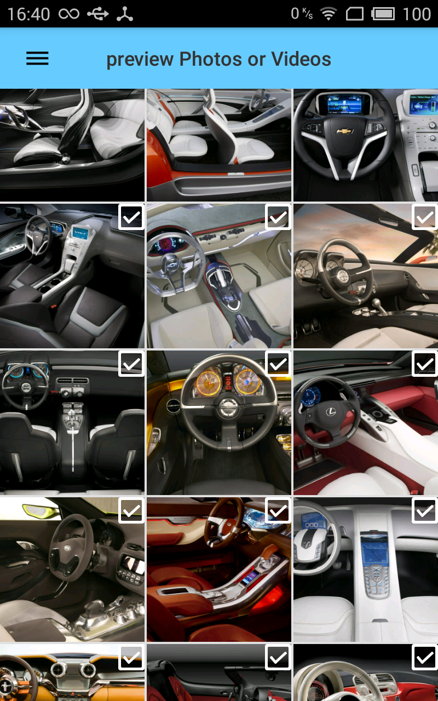
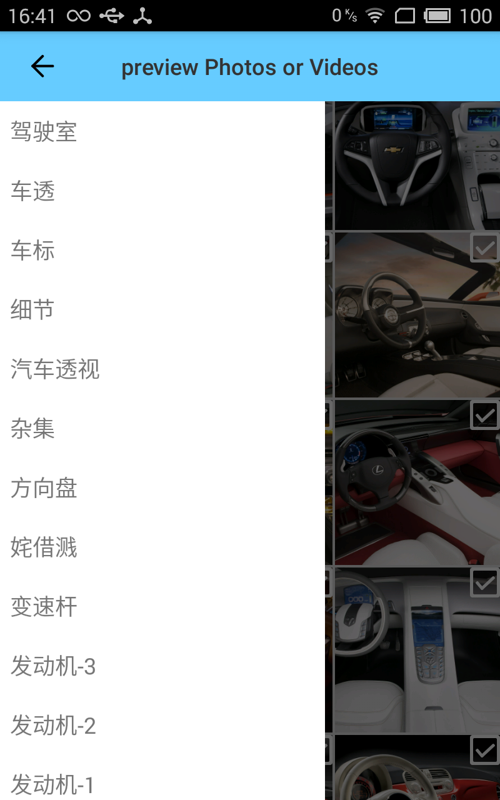

# MediaPreview
**一个相册浏览软件，任何软件可以从此获取多张图片或单个视频。获取方式如下：**

	Intent intent = new Intent(Intent.ACTION_PICK);
    // "video/*" 或 "image/*" 任意一个即可
    intent.setType("image/*");
    // 允许选择多张图片
    intent.putExtra(Intent.EXTRA_ALLOW_MULTIPLE, true);
    // 启动Activity
    startActivityForResult(intent, 1);

###主界面为显示手机中所存的图片

###则滑显示图片主目录名称

   
    
